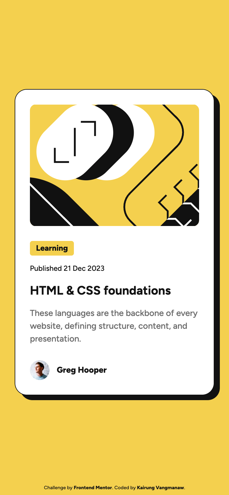
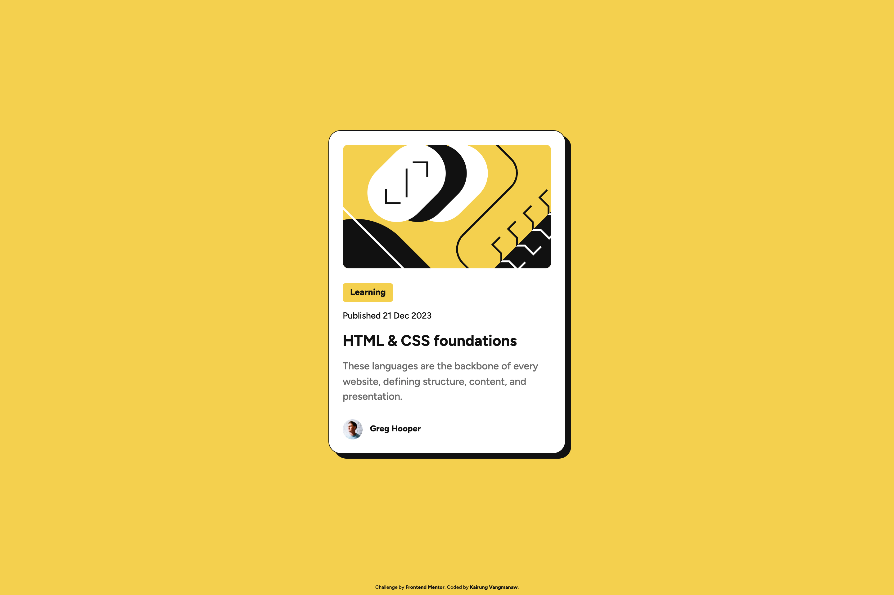
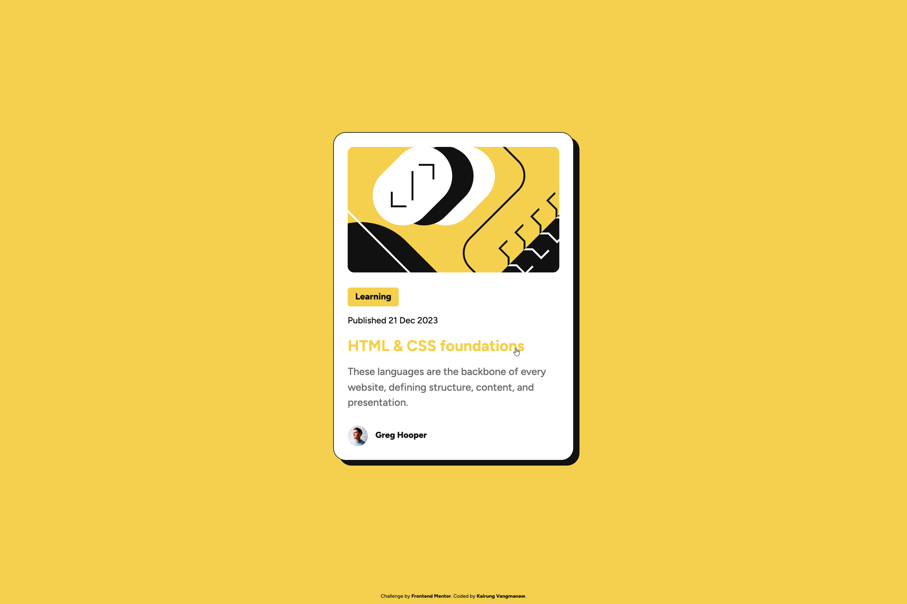

# Frontend Mentor - Blog preview card solution


This is a solution to the [Blog preview card challenge on Frontend Mentor](https://www.frontendmentor.io/challenges/blog-preview-card-ckPaj01IcS). Frontend Mentor challenges help you improve your coding skills by building realistic projects.

## Table of contents

- [Frontend Mentor - Blog preview card solution](#frontend-mentor---blog-preview-card-solution)
  - [Table of contents](#table-of-contents)
  - [Overview](#overview)
    - [The challenge](#the-challenge)
    - [Screenshot](#screenshot)
    - [Links](#links)
  - [My process](#my-process)
    - [Built with](#built-with)
    - [What I learned](#what-i-learned)
    - [Continued development](#continued-development)
    - [Useful resources](#useful-resources)
    - [AI Collaboration](#ai-collaboration)
  - [Author](#author)
  - [Acknowledgments](#acknowledgments)

## Overview

### The challenge

Users should be able to:

- See hover and focus states for all interactive elements on the page

### Screenshot

<details>
<summary>Mobile view</summary>

</details>
<details>
<summary>Desktop view</summary>

</details>
<details>
<summary>Active state view</summary>

</details>

### Links

- Solution URL: [Add solution URL here](https://your-solution-url.com)
- Live Site URL: [Add live site URL here](https://your-live-site-url.com)

## My process

### Built with

- Semantic HTML5 markup
- CSS Custom Properties (Variables)
- Flexbox
- Mobile-first workflow
- BEM (Block Element Modifier) methodology
- Modern CSS `clamp()` function for fluid typography
- [React](https://react.js.org/) - JS library
- [Vite](https://vitejs.dev/) - Next Generation Frontend Tooling

### What I learned

Working on this challenge provided several valuable takeaways regarding modern CSS techniques, responsive strategy, and semantic structure:

1. **Native `object-fit` vs. Background Images:** I discovered the power of the `object-fit` CSS property. I was previously accustomed to handling image scaling using `background-size`, but learning how to apply `object-fit: cover` directly to `` elements allowed for cleaner markup and better semantic handling.

2. **Pragmatic Responsive Design Decisions:** I realized that relying on complex responsive techniques like `aspect-ratio` isn't always necessary for every component. Instead of calculating aspect ratios, specifying an explicit fixed `height` in combination with `object-fit: cover` met the design requirements precisely across both mobile and desktop viewports, making the codebase cleaner, more readable, and easier to maintain.

3. **Fluid Typography without Media Queries:** I implemented CSS `clamp()` to seamlessly adjust font sizes between mobile and desktop screen sizes, eliminating the need for extra media query definitions for typography.

4. **Semantic HTML & Accessibility (a11y):** Refined the document structure by utilizing correct elements such as `<article>`, `<time dateTime="...">`, and `<footer>` within the component, along with specifying appropriate `alt` attributes and ARIA attributes (`aria-hidden`, `aria-label`).

```css
/* Example of pragmatic layout and fluid typography */
.card__image {
  width: 100%;
  height: 200px;
  object-fit: cover;
  border-radius: 10px;
}

.card__title {
  font-size: clamp(1.25rem, 1.155rem + 0.405vw, 1.52rem);
}
```

### Continued development

This card component provides a solid foundation that can easily be scaled into more complex web applications. Moving forward, I plan to:

- **Dynamic Data & API Integration**: Refactor the component to accept dynamic props and connect it with external APIs—such as news feeds, academic papers, blog CMS endpoints, or custom databases.

- **Component Scalability**: Explore rendering lists of cards dynamically using data mapping and state management in React.

- **Advanced Accessibility**: Continue deepening my knowledge of WCAG standards and keyboard navigation patterns for complex interactive components.

### Useful resources

- [`object-fit` CSS property - MDN Docs](https://developer.mozilla.org/en-US/docs/Web/CSS/Reference/Properties/object-fit) - Helped me understand how to control image fitting directly on `` elements instead of relying on `background-size`.

- [`aspect-ratio` CSS property - MDN Docs](http://developer.mozilla.org/en-US/docs/Web/CSS/Reference/Properties/aspect-ratio) - While I ultimately chose an explicit height for this specific design, experimenting with `aspect-ratio` expanded my CSS toolkit for future layout strategies.

### AI Collaboration

Throughout this challenge, I leveraged Google Gemini and Google Search AI Mode as thought partners to:

- Conduct deep code reviews focusing on Semantic HTML and BEM methodology.

- Verify React/JSX attributes and Accessibility (a11y) best practices.

- Explore modern CSS solutions like Fluid Typography via `clamp()`.

Collaborating with AI helped streamline my problem-solving process and validate technical trade-offs efficiently.

## Author

- GitHub: [Kairung Vangmanaw](https://github.com/VangmanawKairung)
- Frontend Mentor - [@VangmanawKairung](https://www.frontendmentor.io/profile/VangmanawKairung)

## Acknowledgments

I would like to express my sincere gratitude to myself for staying persistent, curious, and dedicated to continuous improvement.

Special thanks to:

- **Frontend Mentor** for providing realistic design challenges that help sharpen real-world frontend skills.

- **macOS Preview**: Using the native Preview app alongside a design overlay proved invaluable for quickly inspecting pixel values and confirming measurements, significantly speeding up the development process compared to trial and error.

- **Google Gemini & Google Search AI Mode** for serving as reliable technical advisors during the development and code review process.
